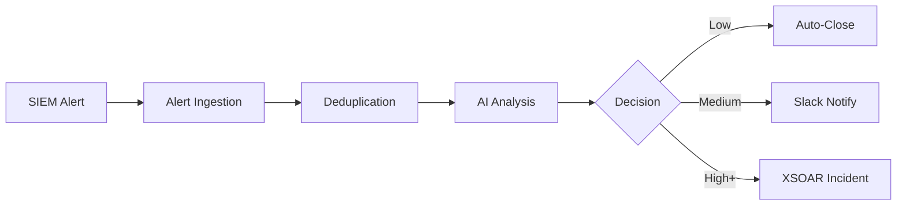

# X-n8 Playbook Index

> **Complete Reference for All 200 n8n Workflow Playbooks**

<p align="center">
  
</p>

---

## 📊 Playbook Statistics

| Metric | Count |
|--------|-------|
| **Total Playbooks** | 200 |
| **Core Workflows** | 3 |
| **Category Playbooks** | 197 |
| **Fully Implemented (JSON)** | 17 |
| **Templates (Documented)** | 183 |

---

## 🔧 Core Engine Workflows

These are the foundational workflows that power X-n8:

| # | Playbook Name | Description | File | Status |
|---|---------------|-------------|------|--------|
| 1 | **Alert Ingestion Master** | Main webhook receiver with multi-SIEM normalization | [📄 alert-ingestion.json](../n8n-workflows/core/alert-ingestion.json) | ✅ Implemented |
| 2 | **AI Analysis Engine** | LLM-powered triage with severity scoring | [📄 ai-analysis.json](../n8n-workflows/core/ai-analysis.json) | ✅ Implemented |
| 3 | **Deduplication & Clustering** | Redis-based alert dedup and entity clustering | [📄 deduplication.json](../n8n-workflows/core/deduplication.json) | ✅ Implemented |

### Core Workflow Architecture



---

## 📁 Category Playbooks

### 1. API Security (Playbooks 4-23)

| # | Playbook | Use Case | MITRE | File | Status |
|---|----------|----------|-------|------|--------|
| 4 | Shadow API Detection | UC-001 | T1190 | [📄 shadow-api-detection.json](../n8n-workflows/categories/api-security/shadow-api-detection.json) | ✅ |
| 5 | BOLA Detection | UC-002 | T1078.004 | [📄 bola-detection.json](../n8n-workflows/categories/api-security/bola-detection.json) | ✅ |
| 6 | JWT Tampering Detection | UC-003 | T1539 | jwt-tampering.json | 📝 Template |
| 7 | Rate Limit Bypass | UC-004 | T1499.003 | rate-limit-bypass.json | 📝 Template |
| 8 | Data Exposure Detection | UC-005 | T1530 | data-exposure.json | 📝 Template |
| 9 | GraphQL Introspection | UC-006 | T1595.002 | graphql-introspection.json | 📝 Template |
| 10 | API Key Leakage | UC-007 | T1552.001 | api-key-leakage.json | 📝 Template |
| 11 | Mass Assignment | UC-008 | T1190 | mass-assignment.json | 📝 Template |
| 12 | Auth Bypass Detection | UC-009 | T1556 | auth-bypass.json | 📝 Template |
| 13 | BFLA Detection | UC-010 | T1078 | bfla-detection.json | 📝 Template |
| 14 | Endpoint Enumeration | UC-011 | T1595.002 | endpoint-enum.json | 📝 Template |
| 15 | OAuth Token Hijacking | UC-012 | T1550.001 | oauth-hijacking.json | 📝 Template |
| 16 | Response Manipulation | UC-013 | T1557 | response-mitm.json | 📝 Template |
| 17 | SSRF via API | UC-014 | T1190 | ssrf-detection.json | 📝 Template |
| 18 | Old API Exploitation | UC-015 | T1190 | old-api-exploit.json | 📝 Template |
| 19 | WebSocket Injection | UC-016 | T1190 | websocket-inject.json | 📝 Template |
| 20 | Credential Stuffing | UC-017 | T1110.004 | credential-stuffing.json | 📝 Template |
| 21 | Business Logic Abuse | UC-018 | T1190 | business-logic.json | 📝 Template |
| 22 | Debug Endpoint Exposure | UC-019 | T1190 | debug-endpoint.json | 📝 Template |
| 23 | API DoS Detection | UC-020 | T1499 | api-dos.json | 📝 Template |

---

### 2. Cloud Security (Playbooks 24-48)

| # | Playbook | Use Case | Platform | File | Status |
|---|----------|----------|----------|------|--------|
| 24 | IAM User No MFA | UC-021 | AWS | iam-no-mfa.json | 📝 Template |
| 25 | S3 Public Access | UC-022 | AWS | [📄 s3-public-access.json](../n8n-workflows/categories/cloud-security/s3-public-access.json) | ✅ |
| 26 | IMDS Exploitation | UC-023 | AWS | imds-exploit.json | 📝 Template |
| 27 | Azure Role Escalation | UC-024 | Azure | azure-role-escalation.json | 📝 Template |
| 28 | GCP SA Key Creation | UC-025 | GCP | gcp-sa-key.json | 📝 Template |
| 29 | Cross-Account Access | UC-026 | AWS | cross-account.json | 📝 Template |
| 30 | Azure Blob Anonymous | UC-027 | Azure | azure-blob-public.json | 📝 Template |
| 31 | GCP Firewall Mod | UC-028 | GCP | gcp-firewall-mod.json | 📝 Template |
| 32 | Root Account Activity | UC-029 | AWS | root-activity.json | 📝 Template |
| 33 | Untagged Resources | UC-030 | Multi | untagged-resources.json | 📝 Template |
| 34 | K8s RBAC Escalation | UC-031 | K8s | k8s-rbac-escalation.json | 📝 Template |
| 35 | CloudTrail Disabled | UC-032 | AWS | cloudtrail-disabled.json | 📝 Template |
| 36 | Key Vault Anomaly | UC-033 | Azure | keyvault-anomaly.json | 📝 Template |
| 37 | BigQuery Export | UC-034 | GCP | bigquery-export.json | 📝 Template |
| 38 | Cross-Cloud Movement | UC-035 | Multi | cross-cloud-lateral.json | 📝 Template |
| 39 | SG 0.0.0.0/0 Rule | UC-036 | AWS | sg-open-world.json | 📝 Template |
| 40 | Azure Logging Disabled | UC-037 | Azure | azure-logging-off.json | 📝 Template |
| 41 | Public Registry Pull | UC-038 | Container | public-registry.json | 📝 Template |
| 42 | Lambda Permission | UC-039 | AWS | lambda-permission.json | 📝 Template |
| 43 | GCP Org-Level IAM | UC-040 | GCP | gcp-org-iam.json | 📝 Template |
| 44 | Secrets in Environment | UC-041 | Serverless | secrets-in-env.json | 📝 Template |
| 45 | Managed Identity Theft | UC-042 | Azure | managed-identity.json | 📝 Template |
| 46 | Mass Resource Delete | UC-043 | Multi | mass-delete.json | 📝 Template |
| 47 | Terraform State Public | UC-044 | IaC | tf-state-public.json | 📝 Template |
| 48 | Unusual Spending | UC-045 | Multi | unusual-spending.json | 📝 Template |

---

### 3. DLP (Playbooks 49-68)

| # | Playbook | Use Case | Channel | File | Status |
|---|----------|----------|---------|------|--------|
| 49 | USB Storage Alert | UC-046 | Physical | usb-storage.json | 📝 Template |
| 50 | USB Exfiltration | UC-047 | Physical | [📄 usb-exfiltration.json](../n8n-workflows/categories/dlp/usb-exfiltration.json) | ✅ |
| 51 | Personal Cloud Upload | UC-048 | Cloud | personal-cloud.json | 📝 Template |
| 52 | Source Code Leak | UC-049 | Repository | source-code-leak.json | 📝 Template |
| 53 | Mass File Download | UC-050 | Network | mass-download.json | 📝 Template |
| 54 | Email Sensitive Data | UC-051 | Email | email-sensitive.json | 📝 Template |
| 55 | Print Job Detection | UC-052 | Physical | suspicious-print.json | 📝 Template |
| 56 | Screen Capture | UC-053 | Endpoint | screen-capture.json | 📝 Template |
| 57 | Steganography Upload | UC-054 | Files | steganography.json | 📝 Template |
| 58 | DNS Tunneling | UC-055 | DNS | dns-tunneling.json | 📝 Template |
| 59 | Password Archive | UC-056 | Files | password-archive.json | 📝 Template |
| 60 | Clipboard Sensitive | UC-057 | Endpoint | clipboard-data.json | 📝 Template |
| 61 | Unauthorized FTP | UC-058 | Network | unauthorized-ftp.json | 📝 Template |
| 62 | Database Export | UC-059 | Database | db-export.json | 📝 Template |
| 63 | Wireless Transfer | UC-060 | Physical | wireless-transfer.json | 📝 Template |
| 64 | External Sharing | UC-061 | SaaS | external-sharing.json | 📝 Template |
| 65 | Cloud Sync Upload | UC-062 | Cloud | cloud-sync.json | 📝 Template |
| 66 | API Bulk Export | UC-063 | API | api-bulk-export.json | 📝 Template |
| 67 | Unauthorized SaaS | UC-064 | SaaS | unauthorized-saas.json | 📝 Template |
| 68 | File Rename Evasion | UC-065 | Endpoint | file-rename.json | 📝 Template |

---

### 4. EDR (Playbooks 69-93)

| # | Playbook | Use Case | MITRE | File | Status |
|---|----------|----------|-------|------|--------|
| 69 | Auto Host Isolation | UC-066 | T1486 | [📄 auto-host-isolation.json](../n8n-workflows/categories/edr/auto-host-isolation.json) | ✅ |
| 70 | Memory Dump | UC-067 | T1055 | memory-dump.json | 📝 Template |
| 71 | PsExec Detection | UC-068 | T1021.002 | psexec-detection.json | 📝 Template |
| 72 | LOLBin Abuse | UC-069 | T1218 | lolbin-abuse.json | 📝 Template |
| 73 | LSASS Dumping | UC-070 | T1003.001 | lsass-dumping.json | 📝 Template |
| 74 | Ransomware Response | UC-071 | T1486 | [📄 ransomware-response.json](../n8n-workflows/categories/edr/ransomware-response.json) | ✅ |
| 75 | RDP Brute Force | UC-072 | T1110.001 | rdp-brute-force.json | 📝 Template |
| 76 | Scheduled Task | UC-073 | T1053.005 | scheduled-task.json | 📝 Template |
| 77 | C2 Framework | UC-074 | T1059.001 | c2-framework.json | 📝 Template |
| 78 | USB HID Attack | UC-075 | T1091 | usb-hid.json | 📝 Template |
| 79 | WMI Persistence | UC-076 | T1546.003 | wmi-persistence.json | 📝 Template |
| 80 | DLL Side-Loading | UC-077 | T1574.002 | dll-sideload.json | 📝 Template |
| 81 | Kernel Driver Load | UC-078 | T1068 | kernel-driver.json | 📝 Template |
| 82 | Boot Sector Mod | UC-079 | T1542.001 | boot-sector.json | 📝 Template |
| 83 | Process Anomaly | UC-080 | T1059 | process-anomaly.json | 📝 Template |
| 84 | Agent Tampering | UC-081 | T1562.001 | agent-tampering.json | 📝 Template |
| 85 | Malware Hash | UC-082 | T1204 | malware-hash.json | 📝 Template |
| 86 | Malicious Script | UC-083 | T1059 | malicious-script.json | 📝 Template |
| 87 | Share Enumeration | UC-084 | T1135 | share-enum.json | 📝 Template |
| 88 | AMSI Bypass | UC-085 | T1562.001 | amsi-bypass.json | 📝 Template |
| 89 | Alert Storm | UC-086 | Multiple | alert-storm.json | 📝 Template |
| 90 | Browser Password Theft | UC-087 | T1555.003 | browser-passwords.json | 📝 Template |
| 91 | Thread Injection | UC-088 | T1055.003 | thread-injection.json | 📝 Template |
| 92 | System Discovery | UC-089 | T1082 | system-discovery.json | 📝 Template |
| 93 | Security Config Mod | UC-090 | T1562.002 | security-config.json | 📝 Template |

---

### 5. Email Security (Playbooks 94-113)

| # | Playbook | Use Case | MITRE | File | Status |
|---|----------|----------|-------|------|--------|
| 94 | Zero-Day Attachment | UC-091 | T1566.001 | zero-day-attachment.json | 📝 Template |
| 95 | BEC Detection | UC-092 | T1566.002 | [📄 bec-detection.json](../n8n-workflows/categories/email-security/bec-detection.json) | ✅ |
| 96 | Mailbox Sweep | UC-093 | T1114.002 | mailbox-sweep.json | 📝 Template |
| 97 | Phishing Link Click | UC-094 | T1566.002 | phishing-click.json | 📝 Template |
| 98 | Spoofed Domain | UC-095 | T1566.002 | spoofed-domain.json | 📝 Template |
| 99 | Mass Phishing | UC-096 | T1566 | mass-phishing.json | 📝 Template |
| 100 | Credential Harvesting | UC-097 | T1566.003 | credential-harvest.json | 📝 Template |
| 101 | Internal Phishing | UC-098 | T1534 | internal-phishing.json | 📝 Template |
| 102 | Forward Rule | UC-099 | T1114.003 | forward-rule.json | 📝 Template |
| 103 | Malicious Macro | UC-100 | T1566.001 | malicious-macro.json | 📝 Template |
| 104 | VIP Impersonation | UC-101 | T1566.002 | vip-impersonation.json | 📝 Template |
| 105 | Suspicious Attachment | UC-102 | T1566.001 | suspicious-attach.json | 📝 Template |
| 106 | Vendor Compromise | UC-103 | T1566.002 | vendor-compromise.json | 📝 Template |
| 107 | Quishing (QR Code) | UC-104 | T1566.002 | quishing.json | 📝 Template |
| 108 | Thread Hijacking | UC-105 | T1566 | thread-hijacking.json | 📝 Template |
| 109 | OAuth Phishing | UC-106 | T1566.002 | oauth-phishing.json | 📝 Template |
| 110 | Email DLP | UC-107 | T1048.003 | email-dlp.json | 📝 Template |
| 111 | Reply-To Anomaly | UC-108 | T1566.002 | reply-to-anomaly.json | 📝 Template |
| 112 | Password Archive | UC-109 | T1566.001 | password-archive.json | 📝 Template |
| 113 | Auto-Reply Loop | UC-110 | T1114 | auto-reply-loop.json | 📝 Template |

---

### 6. IAM (Playbooks 114-133)

| # | Playbook | Use Case | MITRE | File | Status |
|---|----------|----------|-------|------|--------|
| 114 | Brute Force | UC-111 | T1110.001 | brute-force.json | 📝 Template |
| 115 | MFA Fatigue | UC-112 | T1621 | [📄 mfa-fatigue-detection.json](../n8n-workflows/categories/iam/mfa-fatigue-detection.json) | ✅ |
| 116 | Privilege Escalation | UC-113 | T1078.002 | priv-escalation.json | 📝 Template |
| 117 | Dormant Account | UC-114 | T1078.003 | dormant-account.json | 📝 Template |
| 118 | Service Account Abuse | UC-115 | T1078.001 | service-account.json | 📝 Template |
| 119 | Password Spray | UC-116 | T1110.003 | password-spray.json | 📝 Template |
| 120 | Admin Lockout | UC-117 | T1531 | admin-lockout.json | 📝 Template |
| 121 | SSO Session Anomaly | UC-118 | T1550.001 | sso-anomaly.json | 📝 Template |
| 122 | Group Membership | UC-119 | T1098.001 | group-membership.json | 📝 Template |
| 123 | API Token Anomaly | UC-120 | T1552 | api-token-anomaly.json | 📝 Template |
| 124 | Guest Account Abuse | UC-121 | T1078.003 | guest-abuse.json | 📝 Template |
| 125 | PAM Checkout | UC-122 | T1078.004 | pam-checkout.json | 📝 Template |
| 126 | Cert Auth Abuse | UC-123 | T1552.004 | cert-auth-abuse.json | 📝 Template |
| 127 | Kerberoasting | UC-124 | T1558.003 | kerberoasting.json | 📝 Template |
| 128 | Golden Ticket | UC-125 | T1558.001 | golden-ticket.json | 📝 Template |
| 129 | MFA Enrollment | UC-126 | T1556.006 | mfa-enrollment.json | 📝 Template |
| 130 | Recovery Change | UC-127 | T1098.005 | recovery-change.json | 📝 Template |
| 131 | Failed Auth Threshold | UC-128 | T1110 | failed-auth.json | 📝 Template |
| 132 | Account Takeover | UC-129 | T1078 | account-takeover.json | 📝 Template |
| 133 | Delegated Permission | UC-130 | T1098 | delegated-perm.json | 📝 Template |

---

### 7-12. Additional Categories (Playbooks 134-253)

| Category | Playbooks | Use Cases | Implemented |
|----------|-----------|-----------|-------------|
| **Firewall** | 134-153 | UC-131 to UC-150 | 1 (auto-ip-block) |
| **Impossible Travel** | 154-168 | UC-151 to UC-165 | 1 |
| **Insider Threat** | 169-188 | UC-166 to UC-185 | 1 |
| **SaaS Security** | 189-208 | UC-186 to UC-205 | 1 |
| **WAF** | 209-228 | UC-206 to UC-225 | 1 |
| **Threat Intel** | 229-253 | UC-226 to UC-250 | 1 |

---

## 🚀 Importing Playbooks

### CLI Method

```bash
# Import all implemented playbooks
for f in $(find n8n-workflows -name "*.json"); do
  n8n import:workflow --input="$f"
  echo "Imported: $f"
done
```

### UI Method

1. Go to n8n → **Workflows**
2. Click **Import from File**
3. Select the JSON file
4. Click **Import**

---

## 📊 Playbook Legend

| Symbol | Meaning |
|--------|---------|
| ✅ | Fully implemented (JSON file exists) |
| 📝 Template | Documented, awaiting implementation |
| 📄 | Link to file |

---

## 🔗 Related Documentation

- [Use Case Index](USE-CASE-INDEX.md) - All 450 use cases
- [Architecture](architecture.md) - System design
- [n8n Setup](integration/n8n-setup.md) - Installation guide
- [XSOAR Setup](integration/xsoar-setup.md) - Integration guide

---

<p align="center">
  <a href="https://github.com/Masriyan/X-n8-Exnate">⭐ Star us on GitHub</a>
</p>
